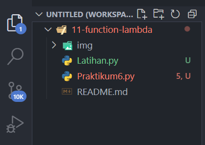
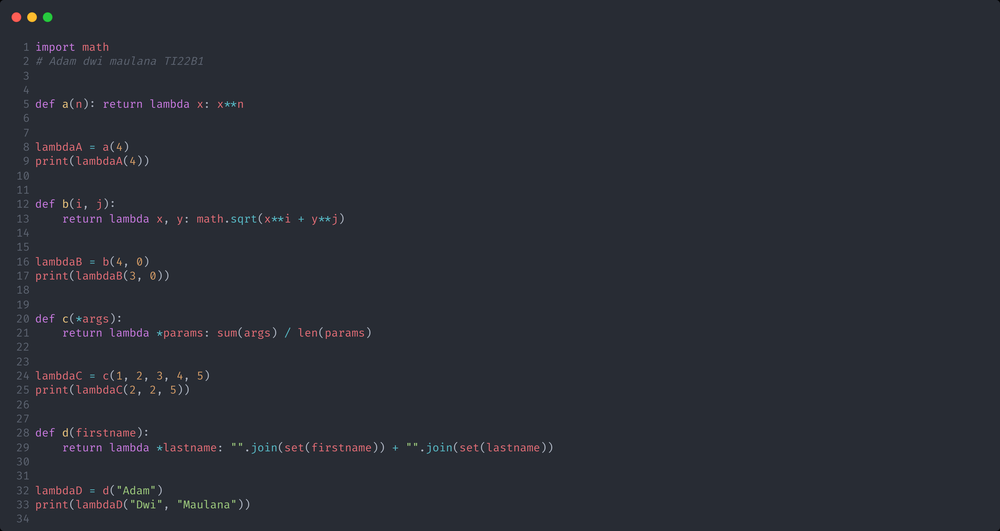
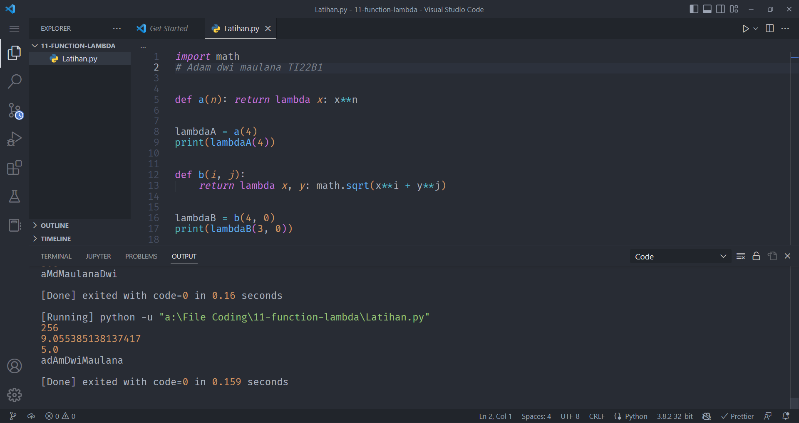
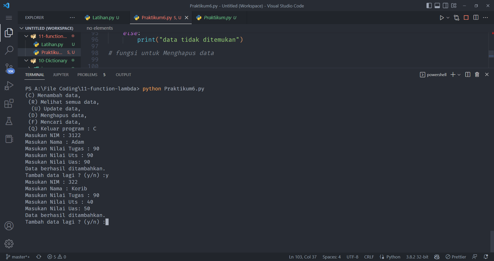
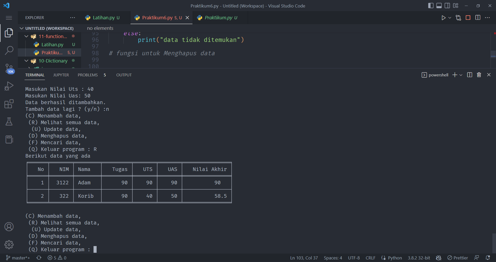
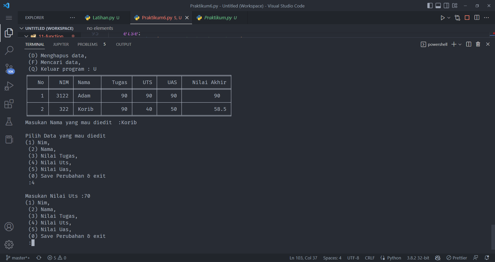
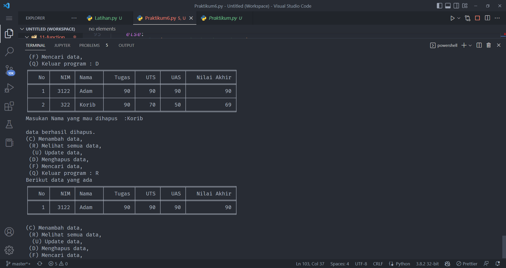

## Latihan Menggunakan Function dan Lambda pada python dan membuat program crud sederhana
### Repository ini dibuat sebagai tugas kuliah bahasa pemrogramman

1. Pertama kita buat buat folder `11-function-lambda` dan didalam kita buat file bernama `Latihan.py` dan `Praktikum6.py`.

      

2. Lalu buka Latihan.py dan masukan coding sebagai berikut lalu run dengan mengetikan perintah berikut diterminal `python Latihan.py`:

      

      dan berikut hasilnya :

      

3. Selanjutnya kita akan buat program crud sederhana dan berikut `flowchart` program yang akan dibuat.

      

4. Lalu buka file `Praktikum6.py` dan masukan codingan sebagai berikut lalu run dengan mengetikan perintah berikut diterminal `python Praktikum6.py`:

      

      dan Berikut hasilnya :

      Jika memilih opsi `C = menambah data` maka akan tampil sebagai berikut :

      

      Jika memilih opsi `R = Melihat semua data` maka akan tampil sebagai berikut :

      

      Jika memilih opsi `U = mengupdate data` maka akan tampil sebagai berikut :

      

      Jika memilih opsi `D = Menghapus data` maka akan tampil sebagai berikut :

      

      Jika memilih opsi `Q = Keluar Program` maka akan tampil sebagai berikut :

      

### selesai. seperti itulah program crud sederhana yang kita buat,

[sawer](https://saweria.co/adamwebdev)

